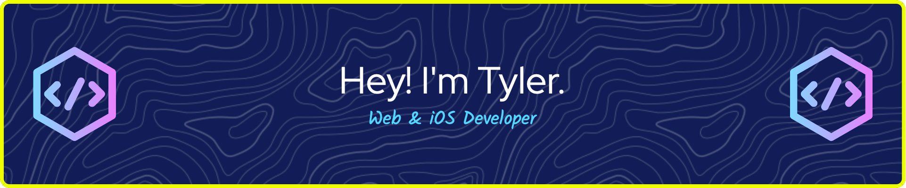

## Hi there! 👋



```js
const aboutMe = {
  name: "Tyler Anderson",
  role: "Web & iOS Developer",
  learning: ["C (Flipper Zero)"],
  passions: ["Learning new skills"],
  tools: {
    web: ["HTML", "CSS", "JavaScript"],
    mobile: ["Swift", "Xcode"],
    embedded: ["C", "Flipper Zero SDK"],
  },
};

function introduce(dev) {
  console.log(`Hi, I'm ${dev.name}! 👋`);
  console.log(`I'm a ${dev.role} passionate about ${dev.passions.join(", ")}.`);
}

introduce(aboutMe);
```

<p align="center">
    
</p>
<p align="center">
    
</p>
<p align="center">
    
</p>


